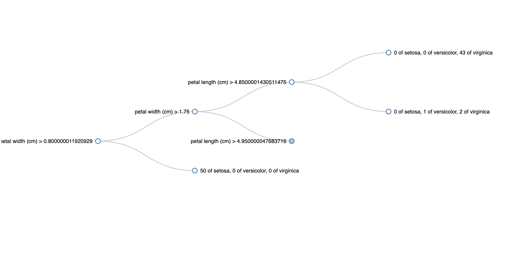

# Decision-Tree-Visual

## Try me:

1. Use the D3-Sklearn notebook and insert any dataset. This will spit out a json called `rules.json` or whatever name you specify in the code. 

2. In the index.html file at line 54 where it says d3.json, insert the name of the json file. Run the index.html in a Live Server and voila!

Acknowledgements: Aaron Schumacher

